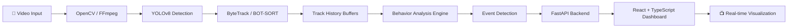

<div align="center">

# 🛡️ Sentinel-Edge

### Autonomous, real-time safety tracking for industrial environments

*Detect risky behavior before it becomes an accident.*


· [Features](#-key-features) · [Architecture](#-system-architecture) · [Quick Start](#-quick-start) · [Team](#-team)

</div>

---

## 📌 Overview

Warehouses and factory floors are crowded, fast-moving, and full of hazards. Manual CCTV monitoring doesn't scale, and by the time a human notices a problem, it's often too late.

**Sentinel-Edge** is an agentic computer-vision system that watches the feed for you. It combines **multi-object tracking** with a custom **risk-assessment engine** that analyzes each person's kinematic trajectory to detect anomalies, log incidents with evidence, and raise alerts in real time.

> **From raw CCTV footage → tracked individuals → behavior analysis → scored risk → timestamped incident report with screenshot.**

---

## 🎯 The Problem

| Challenge | Impact |
|---|---|
| Large areas, many cameras, few operators | Incidents go unnoticed |
| Restricted zones are hard to enforce manually | Unauthorized access to hazardous areas |
| Running, loitering, and idling are early warning signs | Detected only after something goes wrong |
| Alert fatigue from duplicate notifications | Real incidents get ignored |

## 💡 Our Solution

Sentinel-Edge turns passive video into **actionable, deduplicated safety events**, each with a timestamp, risk level, and visual evidence, streamed live to a monitoring dashboard.

---

## 🚀 Key Features

| Feature | Description |
|---|---|
| 🚶 **Behavior Analytics** | Classifies walking, running, idle, and stationary loitering per tracked person |
| 📈 **Movement & Trajectories** | Speed estimation and continuous path-history visualization |
| ⚠️ **Risk Assessment Engine** | Real-time risk scoring that classifies suspicious activity and triggers automated alerts |
| 🚧 **Restricted-Zone Detection** | Virtual boundaries that flag unauthorized entry |
| 🧾 **Automated Incident Reports** | Timestamped JSON event data plus automatic screenshots of each anomaly |
| 🔕 **Alert Deduplication** | Suppresses repeat alerts so operators only see what matters |
| 📊 **Live Dashboard** | Tracking info, risk levels, event counts, FPS metrics, and an active incident timeline |

---

## 🔄 System Architecture



**How it works**

1. **Ingest:** OpenCV/FFmpeg decode frames and keep frame-to-timestamp sync.
2. **Detect:** YOLOv8 finds people in every frame.
3. **Track:** ByteTrack / BOT-SORT assign persistent IDs, even through partial occlusion.
4. **Buffer:** Per-ID track-history buffers store recent positions for kinematic analysis.
5. **Analyze:** The behavior engine computes speed, dwell time, and zone membership to label behavior.
6. **Score & Alert:** The risk engine scores each person and emits deduplicated events.
7. **Stream:** FastAPI pushes live telemetry to the React dashboard, which draws overlays on a Canvas.

---

## 🛠️ Tech Stack

**👁️ Computer Vision & AI**
- Detection & Tracking: Ultralytics **YOLOv8**, **ByteTrack / BOT-SORT**
- Processing & Math: **OpenCV**, **NumPy**
- Logic: Custom behavior-analysis engine with temporal anomaly detection and track-history buffers
- Data Output: JSON detection, tracking, and event logs

**🖥️ Frontend (Real-time Dashboard)**
- **React.js**, **TypeScript**, **Tailwind CSS**, **Framer Motion**
- **HTML5 Video API** and **Canvas API** for live detection overlays

**⚙️ Backend**
- **Python**, **FastAPI**, **Uvicorn** (REST + WebSocket telemetry)
- Frame-to-timestamp synchronization via **FFmpeg / OpenCV**

---


| Live Tracking & Trajectories | Incident Timeline |
|---|---|
|  |  |

*(Replace with your own screenshots in `docs/screenshots/`.)*

### Sample Incident Output

```json
{
  "event_id": "evt_0001",
  "timestamp": "00:01:23.450",
  "track_id": 7,
  "behavior": "restricted_zone_entry",
  "risk_level": "HIGH",
  "screenshot": "incidents/evt_0001.jpg"
}
```

*(Illustrative format; adjust fields to match your actual schema.)*

---

## 💻 Quick Start

### Prerequisites
- Python 3.10+
- Node.js 18+
- FFmpeg installed and on your `PATH`

### 1️⃣ Vision & Backend Server (Python / FastAPI)

```bash
# Clone the repository
git clone https://github.com/yourusername/Sentinel-Edge.git
cd Sentinel-Edge/backend

# Create and activate a virtual environment
python -m venv venv
source venv/bin/activate        # Windows: venv\Scripts\activate

# Install dependencies
pip install ultralytics opencv-python numpy fastapi uvicorn

# Start the API server
uvicorn main:app --reload
```

### 2️⃣ Frontend Command Center (React / TypeScript)

```bash
cd ../frontend
npm install
npm run dev
```

Open the URL printed in your terminal (typically `http://localhost:5173`) and load a sample `.mp4` feed.

---

## 🏁 Hackathon Scope

### ✅ Minimum Viable Solution (Delivered)
- [x] Real-time multi-person tracking with persistent IDs (YOLOv8 + ByteTrack)
- [x] Custom risk engine detecting **idle time**, **running**, and **restricted-zone entry**
- [x] Live React dashboard showing tracking info, risk levels, and automated JSON incident reports

### 📥 Sample Input
Raw `.mp4` wide-angle industrial CCTV footage with heavy activity and occlusion.

### 📤 Sample Output
A synchronized local dashboard showing the video feed with drawn kinematic trajectories, live FPS metrics, and a real-time event log with captured anomaly screenshots.

---

## 🗺️ Roadmap

- [ ] PPE detection (helmets, vests)
- [ ] Multi-camera support and cross-camera re-identification
- [ ] Forklift / vehicle–pedestrian proximity alerts
- [ ] Edge deployment on Jetson-class devices
- [ ] Push notifications (SMS / Slack / email)

---

## 👥 Team

| Member | Role | Contributions |
|---|---|---|
| **Joshua Israel** | Vision Engine Developer | Led AI architecture; built the real-time YOLOv8 + ByteTrack pipeline; engineered behavior analytics (loitering, running, idle, speed, trajectory) and the risk assessment engine; designed automated event logging (screenshots + JSON); optimized performance via alert deduplication and path-history management |
| **Manieesh Kumar** | Backend & Routing | Built the FastAPI/Node.js backend that receives live WebSocket telemetry and routes deduplicated JSON alerts to the database |
| **Arul** | Frontend UI/UX | Developed the real-time dashboard with live tracking info, risk levels, event counts, FPS metrics, and an active incident timeline |
| **Jeffy** | DevOps & Data Ops | Managed environments and Git version control; prepared datasets for the sample input feeds |

---

## 📄 License

Released under the [MIT License](LICENSE). *(Update if you choose a different license.)*

<div align="center">

**Built with ❤️ for the hacknex. Safer workplaces, one frame at a time.**

</div>
